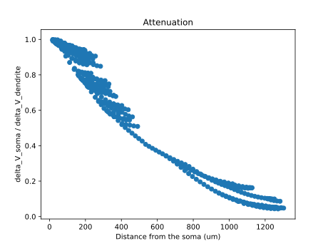
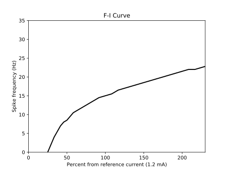

Folders
=======

Attenuation
^^^^^^^^^^^
For investigating the attenuation of the cell. Utilizes a -0.05 mA current clamp.

F-ICurve
^^^^^^^^
Creates the F-I curve for the cell. The reference current is 1.2 mA.

Resistance
^^^^^^^^^^
Looking at the cell's input resistance.

biophys_components
^^^^^^^^^^^^^^^^^^
This is where mechanisms and templates are stored. This folder is used as the basis for all simulations in the project.

