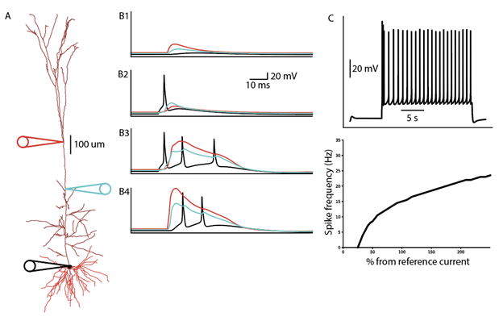
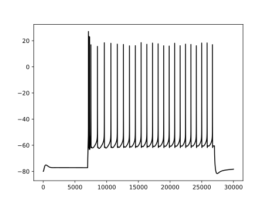

Folders
=======

Attenuation
^^^^^^^^^^^
For investigating the attenuation of the cell. Utilizes a -0.05 mA current clamp.

.. image:: ../../L5NeuronSimulation/Attenuation/Attenuation.svg
  :alt: Attenuation Plot

F-ICurve
^^^^^^^^
Creates the F-I curve for the cell. The reference current is 1.2 mA.

.. image:: ../../L5NeuronSimulation/F-ICurve/F-ICurve.svg
  :alt: F-I Curve

Resistance
^^^^^^^^^^
Looking at the cell's input resistance.

biophys_components
^^^^^^^^^^^^^^^^^^
This is where mechanisms and templates are stored. This folder is used as the basis for all simulations in the project.

* mechanisms: where mod files are. pyr2pyr.mod and int2pyr.mod are the synapse mechanisms used.
* morphologies: morphology files. cell1.asc is used.
* synaptic_models: JSON files containing synaptic parameters. PN2PN.json and INT2PN.json are used.
* templates: hoc cell templates. L5PCtemplate.hoc is the main template, and it utilizes L5PCbiophys3.hoc.

EPSP_Tuning
^^^^^^^^^^^

.. warning::
    THIS NEEDS WORK

Group_EPSC_Tuning
^^^^^^^^^^^^^^^^^
Where EPSC tuning is performed (on both basal and apical dendrites).

.. warning::
    THIS NEEDS WORK

HayFiringProperties
^^^^^^^^^^^^^^^^^^^

Confirming that our cell model matches the experimental firing properties that Hay et al. 2011 tuned for.

IPSC_Tuning
^^^^^^^^^^^
Where IPSC tuning is performed (perisomatic, basal, and apical).

.. warning::
    THIS NEEDS WORK

MorphAnalysis
^^^^^^^^^^^^^
Folder for exploring the morphology of the cell.

Plot_Cell
^^^^^^^^^
Folder for plotting the cell and synapse locations on the cell.

ShortPlasticity
^^^^^^^^^^^^^^^
Used to build and check short term plasticity for both excitation and inhibition.

StepCurrent
^^^^^^^^^^^
Used to ensure that a suprathreshold step current (0.793 mA) induces the proper behavior (as determined by Hay et al. 2011).

